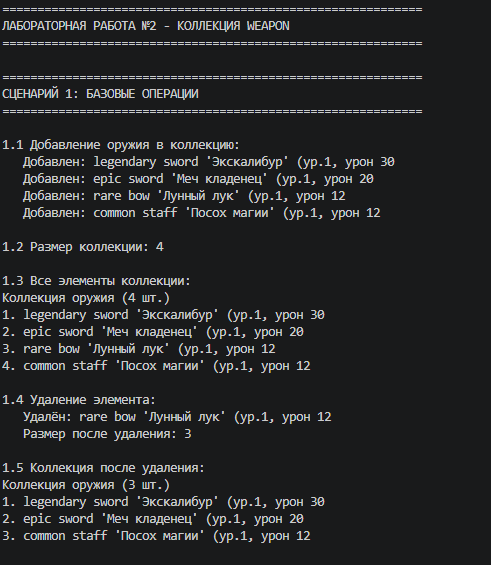

# Лабораторная работа №2, Коллекция объектов, Класс WeaponCollection

## Описание

Реализована коллекция для хранения объектов `Weapon` из первой лабораторной работы. Коллекция позволяет управлять группой оружия: добавлять, удалять, искать, сортировать и фильтровать элементы.

## Класс WeaponCollection

### Атрибуты

| Атрибут | Тип | Описание |
|---------|-----|----------|
| `_items` | list | Закрытый список для хранения объектов Weapon |

---

### Базовые методы

| Метод | Описание |
|-------|----------|
| `add(weapon)` | Добавляет оружие, проверяет тип и дубликаты |
| `remove(weapon)` | Удаляет оружие из коллекции |
| `remove_at(index)` | Удаляет оружие по индексу |
| `get_all()` | Возвращает копию списка |
| `clear()` | Очищает коллекцию |

---

### Методы поиска

| Метод | Описание |
|-------|----------|
| `find_by_name(name)` | Поиск по имени |
| `find_by_type(weapon_type)` | Поиск по типу |
| `find_by_rarity(rarity)` | Поиск по редкости |
| `find_by_level(level)` | Поиск по уровню |

---

### Магические методы

| Метод | Описание |
|-------|----------|
| `__len__()` | Возвращает размер коллекции |
| `__iter__()` | Позволяет итерироваться |
| `__getitem__(index)` | Доступ по индексу и срезам |
| `__contains__(weapon)` | Проверка наличия |
| `__str__()` | Красивый вывод |
| `__repr__()` | Вывод для разработчика |

---

### Сортировка

| Метод | Описание |
|-------|----------|
| `sort_by_name(reverse)` | Сортировка по имени |
| `sort_by_level(reverse)` | Сортировка по уровню |
| `sort_by_damage(reverse)` | Сортировка по урону |
| `sort_by_rarity(reverse)` | Сортировка по редкости |

---

### Фильтрация (возвращают новую коллекцию)

| Метод | Описание |
|-------|----------|
| `filter_by_rarity(rarity)` | Фильтр по редкости |
| `filter_by_min_level(level)` | Фильтр по минимальному уровню |
| `filter_by_min_durability(durability)` | Фильтр по минимальной прочности |

---

## Сценарии работы

### Сценарий 1: Базовые операции

Добавление 4 объектов в коллекцию, вывод размера, удаление одного элемента, повторный вывод.

---

### Сценарий 2: Поиск, итерация, защита от дубликатов

Поиск по имени, типу и редкости. Итерация по коллекции через `for ... in`. Попытка добавить дубликат вызывает ошибку.

---

### Сценарий 3: Индексация, сортировка, фильтрация

Доступ по индексу (включая отрицательные). Сортировка по имени, урону и редкости. Фильтрация по редкости.

---

ЕСЛИ ТЫ ДОЧИТАЛ, ТО ТЫ МОЛОДЕЦ! 