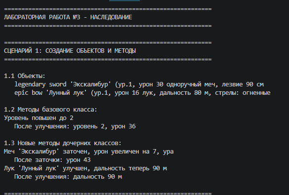

# Лабораторная работа №3
## Наследование и полиморфизм

---

## Цель работы

Освоить механизм наследования классов, научиться строить иерархию объектов, переопределять методы и использовать полиморфизм.

---

## Описание реализованной иерархии классов

### Базовый класс Weapon (из ЛР-1)

Базовый класс для всего оружия. Содержит общие атрибуты и методы:

- `_name` - имя оружия
- `_weapon_type` - тип (sword, bow, staff, dagger)
- `_rarity` - редкость (common, rare, epic, legendary)
- `_level` - уровень (1-10)
- `_durability` - прочность (0-100)
- `_damage` - урон (вычисляется)
- `upgrade()` - повысить уровень
- `attack()` - атаковать
- `repair()` - починить

### Производный класс Sword (Меч)

Добавляет специфические для меча характеристики:

**Новые атрибуты:**
- `blade_length` - длина лезвия в см
- `is_two_handed` - одноручный/двуручный (True/False)

**Новый метод:**
- `sharpen()` - заточка меча (увеличивает урон на 20%)

**Переопределенный метод:**
- `__str__()` - добавляет информацию о типе меча

**Полиморфный метод:**
- `get_special_bonus()` - возвращает бонус меча (+10 к урону)

### Производный класс Bow (Лук)

Добавляет специфические для лука характеристики:

**Новые атрибуты:**
- `range_meters` - дальность стрельбы в метрах
- `arrow_type` - тип стрел (wood, metal, fire)

**Новый метод:**
- `upgrade_bow()` - улучшение лука (увеличивает дальность на 10 м)

**Переопределенный метод:**
- `__str__()` - добавляет информацию о луке

**Полиморфный метод:**
- `get_special_bonus()` - возвращает бонус лука (+20 к дальности)

### Схема иерархии

Weapon (базовый класс)
├── Sword (меч)
│   ├── blade_length
│   ├── is_two_handed
│   ├── sharpen()
│   └── get_special_bonus()
└── Bow (лук)
    ├── range_meters
    ├── arrow_type
    ├── upgrade_bow()
    └── get_special_bonus()

---

## Демонстрация работы

### Сценарий 1: Создание объектов и методы

Демонстрируется создание объектов Sword и Bow, использование методов базового класса (upgrade) и новых методов дочерних классов (sharpen, upgrade_bow).

---

### Сценарий 2: Полиморфизм

Демонстрируется работа полиморфного метода get_special_bonus() - один и тот же метод вызывает разное поведение в разных классах. Также демонстрируется проверка типов через isinstance().

---

### Сценарий 3: Коллекция разных типов оружия

Демонстрируется интеграция с коллекцией из ЛР-2. Коллекция хранит объекты разных типов (Sword и Bow), корректно работает с ними. Показывается фильтрация по типу (только мечи, только луки).

---

## Вывод

В ходе выполнения лабораторной работы N3 были изучены и реализованы:

1. Наследование - классы Sword и Bow наследуют от базового класса Weapon
2. Расширение функциональности - в дочерние классы добавлены новые атрибуты и методы
3. Переопределение методов - метод __str__ переопределен в каждом дочернем классе
4. Полиморфизм - метод get_special_bonus() работает по-разному в разных классах
5. Интеграция с коллекцией - коллекция из ЛР-2 корректно хранит объекты разных типов
6. Фильтрация по типу - методы get_only_swords() и get_only_bows() возвращают коллекции с объектами нужного типа
