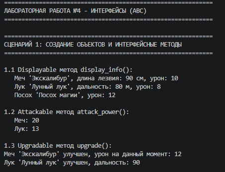

# Лабораторная работа №4
## Интерфейсы и абстрактные классы (ABC)

## Цель работы

Познакомиться с абстрактными базовыми классами (ABC), освоить понятие интерфейса, научиться задавать обязательные методы для классов, закрепить полиморфизм через единый интерфейс.

## Описание интерфейсов

### Displayable

Интерфейс для объектов, которые можно отобразить.

Методы:
- display_info() -> str - возвращает строку с информацией об объекте

### Attackable

Интерфейс для объектов, которые могут атаковать.

Методы:
- attack_power() -> int - возвращает силу атаки

### Upgradable

Интерфейс для объектов, которые можно улучшить.

Методы:
- upgrade() -> bool - улучшает объект

## Реализация в классах

### Sword (Меч)

Реализует интерфейсы: Displayable, Attackable, Upgradable

- display_info(): возвращает строку с именем, длиной лезвия и уроном
- attack_power(): возвращает damage + 10 (бонус +10)
- upgrade(): увеличивает урон на 20%

### Bow (Лук)

Реализует интерфейсы: Displayable, Attackable, Upgradable

- display_info(): возвращает строку с именем, дальностью и уроном
- attack_power(): возвращает damage + 5 (бонус +5)
- upgrade(): увеличивает дальность на 10 метров

### Staff (Посох)

Реализует интерфейс: Displayable

- display_info(): возвращает строку с именем и уроном
- attack_power(), upgrade(): отсутствуют

## Демонстрация работы

### Сценарий 1: Создание объектов и интерфейсные методы

Демонстрируется создание объектов Sword, Bow, Staff и вызов методов display_info(), attack_power(), upgrade()

### Сценарий 2: Интерфейс как тип и проверка isinstance

Демонстрируется проверка типов через isinstance() и универсальная функция print_all_displayable()

### Сценарий 3: Коллекция и фильтрация по интерфейсу

Демонстрируется работа коллекции с объектами разных типов и фильтрация по интерфейсу через get_displayable() и get_attackable()

## Вывод

В ходе выполнения лабораторной работы N4 были изучены и реализованы:

1. Абстрактные классы и интерфейсы через ABC
2. Абстрактные методы с декоратором abstractmethod
3. Множественная реализация интерфейсов в классах Sword, Bow, Staff
4. Полиморфизм через единый интерфейс
5. Фильтрация коллекции по интерфейсу
