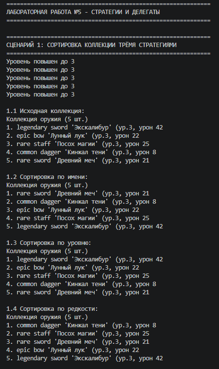

# Лабораторная работа №5
## Функции как аргументы. Стратегии и делегаты

## Цель работы

Освоить передачу функций как аргументов, изучить функции высшего порядка (map, filter, sorted), реализовать паттерн «Стратегия» и callable-объекты.

## Реализованные функции и стратегии

### Стратегии сортировки (3 шт.)

| Стратегия | Назначение |
|-----------|------------|
| `by_name` | Сортировка по имени |
| `by_level` | Сортировка по уровню |
| `by_rarity` | Сортировка по редкости |

### Функции-фильтры (2 шт.)

| Фильтр | Назначение |
|--------|------------|
| `is_legendary` | Оставляет только легендарное оружие |
| `is_not_broken` | Оставляет только исправное оружие |

### Фабрика функций

| Функция | Описание |
|---------|----------|
| `make_level_filter(min_level)` | Создаёт фильтр по минимальному уровню |

### Callable-объект

| Класс | Описание |
|-------|----------|
| `DamageBonusStrategy` | Стратегия для применения бонуса к урону |

### Методы коллекции

| Метод | Описание |
|-------|----------|
| `sort_by(key_func, reverse)` | Сортировка по переданной стратегии |
| `filter_by(predicate)` | Фильтрация по переданному условию |
| `apply(func)` | Применение функции к каждому элементу |
| `copy()` | Создание копии коллекции |

## Демонстрация работы

### Сценарий 1: Сортировка тремя стратегиями

Демонстрируется сортировка одной коллекции по имени, уровню и редкости.

### Сценарий 2: Фильтрация двумя функциями

Демонстрируется фильтрация коллекции через `filter()` с функциями `is_legendary` и `is_not_broken`.

### Сценарий 3: Map, цепочка операций и callable-объект

Демонстрируется:
- Применение `map()` с lambda
- Фабрика функций `make_level_filter`
- Цепочка операций `filter_by → sort_by → apply`
- Callable-объект `DamageBonusStrategy`
- Сортировка через lambda

## Вывод

В ходе выполнения лабораторной работы №5 были изучены и реализованы:

1. Передача функций как аргументов
2. Функции высшего порядка: `map`, `filter`
3. Lambda-выражения
4. Фабрика функций (замыкания)
5. Callable-объекты
6. Паттерн «Стратегия»
7. Цепочки операций над коллекцией