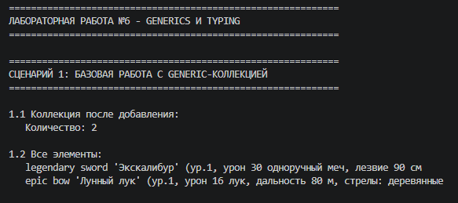

# Лабораторная работа №6

## 1. Цель работы

Освоение системы аннотаций типов в Python (typing), создание обобщённых (generic) классов с помощью TypeVar и Generic, понимание концепции структурной типизации через typing.Protocol.

---

## 2. Описание реализованных типов и контейнеров

**Generic-класс TypedCollection:**
Обобщённая коллекция, параметризуемая типом T. Повторяет интерфейс коллекции из ЛР-2, но добавляет типизацию и новые методы.

**TypeVar и ограничения:**
- `T = TypeVar('T')` — любой тип
- `D = TypeVar('D', bound=Displayable)` — только типы с методом display()
- `S = TypeVar('S', bound=Scorable)` — только типы с методом score()
- `R = TypeVar('R')` — для результатов преобразования в map

**Методы коллекции:**
- `add(item: T) -> None` — добавить элемент
- `remove(item: T) -> None` — удалить элемент
- `get_all() -> List[T]` — получить все элементы
- `find(predicate: Callable[[T], bool]) -> Optional[T]` — поиск первого подходящего
- `filter(predicate: Callable[[T], bool]) -> List[T]` — фильтрация
- `map(transform: Callable[[T], R]) -> List[R]` — преобразование с изменением типа

**Protocols (структурные интерфейсы):**
- `Displayable` — требует метод `display() -> str`
- `Scorable` — требует метод `score() -> float`

Объекты подходят под протокол автоматически, если у них есть нужные методы (без явного наследования).

---

## 3. Демонстрация работы

### Сценарий 1: Базовая работа с Generic-коллекцией

Демонстрируется создание типизированной коллекции, добавление объектов, получение размера и вывод всех элементов.

---

### Сценарий 2: Методы find, filter, map

Демонстрируется:
- `find()` — поиск первого подходящего элемента (или None)
- `filter()` — фильтрация элементов по условию
- `map()` — преобразование элементов с изменением типа результата (List[str] и List[int])

---

### Сценарий 3: Protocols и structural typing

Демонстрируется работа TypedCollection с ограничениями `bound=Displayable` и `bound=Scorable`, вызов методов `display()` и `score()` для объектов разных типов.

---

## 4. Вывод

В ходе выполнения лабораторной работы №6 были изучены и реализованы:

1. **Аннотации типов** — параметры конструктора, возвращаемые значения методов, атрибуты
2. **Generic-классы** — TypedCollection[T] с TypeVar
3. **Методы find, filter, map** — с правильной типизацией (Callable, Optional, List)
4. **Protocols** — структурные интерфейсы Displayable и Scorable
5. **Ограничения TypeVar** — bound=Protocol для типизированных коллекций
