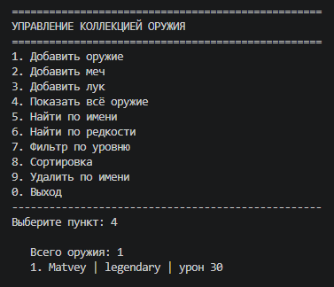

# Лабораторная работа №7

## 1. Цель работы

Объединить все знания, полученные в ЛР1–ЛР6, в единое работающее консольное приложение для управления коллекцией оружия. Реализовать интерактивный CLI-интерфейс с меню, обработкой ошибок ввода, сохранением и загрузкой данных в JSON, а также использовать собственные исключения, типизацию и docstring.

## 2. Структура проекта

src/lab07/
├── main.py          # точка входа, загрузка/сохранение, запуск CLI
├── cli.py           # меню, ввод/вывод, взаимодействие с пользователем
├── app.py           # бизнес-логика, операции над коллекцией
├── models.py        # импорт классов Weapon, Sword, Bow
├── exceptions.py    # собственные исключения
├── storage.py       # сохранение и загрузка JSON
└── README.md        # описание лабораторной работы

| Файл | Назначение |
|------|-----------|
| main.py | Загружает данные из файла, запускает CLI, при выходе сохраняет данные |
| cli.py | Содержит только ввод/вывод: меню, запросы к пользователю, вывод результатов |
| app.py | Содержит бизнес-логику: добавление, удаление, поиск, сортировка, фильтрация |
| models.py | Импортирует классы Weapon, Sword, Bow из ЛР-1 и ЛР-3 |
| exceptions.py | Определяет собственные исключения WeaponNotFoundError и DuplicateWeaponError |
| storage.py | Сохраняет коллекцию в JSON-файл и загружает обратно |

## 3. Описание CLI

### Пункты меню

1. Добавить оружие (базовый Weapon)
2. Добавить меч (Sword с уникальными атрибутами)
3. Добавить лук (Bow с уникальными атрибутами)
4. Показать всё оружие
5. Найти оружие по имени
6. Найти оружие по редкости
7. Фильтровать по минимальному уровню
8. Сортировать (по имени, уровню или урону)
9. Удалить оружие по имени (с подтверждением)
0. Выход

### Обработка ошибок ввода

| Ошибка | Обработка |
|--------|-----------|
| Ввод букв вместо числа | Повторный запрос через get_int() |
| Ввод не числа с плавающей точкой | Повторный запрос через get_float() |
| Пустое имя | Повторный запрос через get_name() |
| Имя с цифрами или спецсимволами | Повторный запрос через get_name() |
| Неверный тип оружия | Повторный запрос через get_weapon_type() |
| Неверная редкость | Повторный запрос через get_rarity() |
| Неверный тип стрел | Повторный запрос через get_arrow_type() |

### Собственные исключения

| Исключение | Когда возникает |
|------------|-----------------|
| DuplicateWeaponError | При попытке добавить оружие с уже существующим именем |
| WeaponNotFoundError | При попытке удалить несуществующее оружие |

### Сохранение и загрузка данных

- Файл: weapons.json в папке запуска
- Автоматическая загрузка при старте программы
- Автоматическое сохранение при выходе
- Формат: JSON

## 4. Демонстрация работы

### Сценарий 1: Запуск -> автозагрузка -> вывод коллекции

При запуске программа загружает ранее сохранённые данные из weapons.json и выводит количество загруженных объектов. Затем пользователь выбирает пункт 4 для просмотра всей коллекции.

### Сценарий 2: Добавление -> удаление с подтверждением -> выход -> повторный запуск

Пользователь добавляет новое оружие, затем удаляет его с подтверждением (y/n), выходит из программы (данные сохраняются). При повторном запуске удалённого оружия уже нет.

### Сценарий 3: Сортировка с выбором стратегии

Пользователь выбирает пункт 8, затем выбирает критерий сортировки (1 - по имени, 2 - по уровню, 3 - по урону) и направление (по возрастанию или убыванию). Коллекция сортируется.

### Сценарий 4: Фильтрация + перехват исключения дубликата

Пользователь выбирает пункт 7 для фильтрации по минимальному уровню. Затем пытается добавить оружие с уже существующим именем — программа перехватывает исключение DuplicateWeaponError и выводит понятное сообщение об ошибке.

## 5. Вывод

В ходе выполнения лабораторной работы №7 были изучены и реализованы:

- разбиение на модули и слои (cli, app, storage)
- CLI-интерфейс с обработкой ошибок ввода
- собственные исключения
- работа с файлами (JSON)
- типизация и docstring
- подтверждение опасных операций
